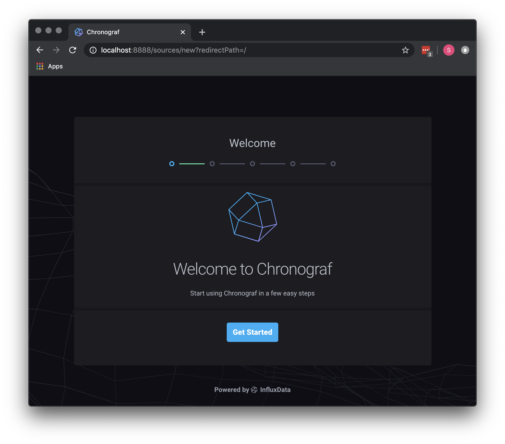
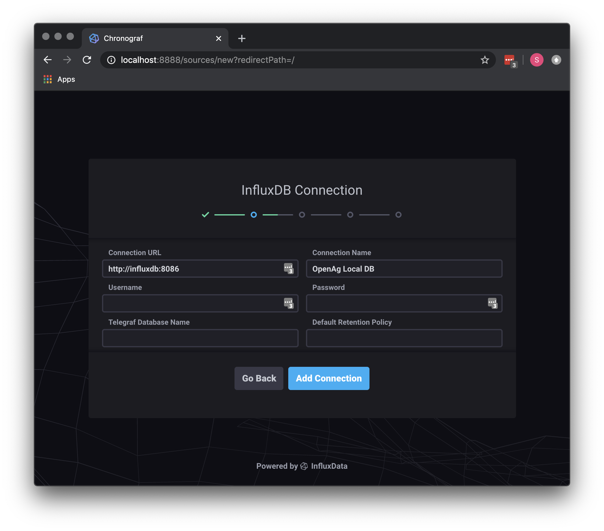
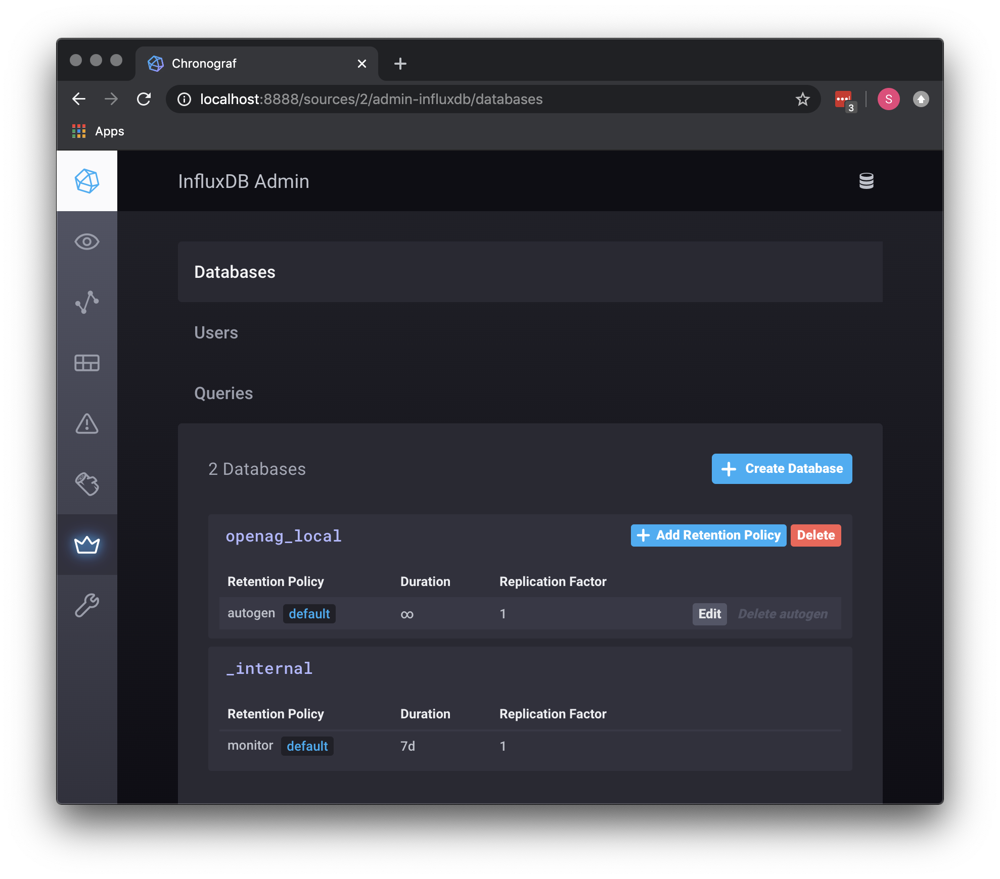

# self_hosted_backend
Project for a docker-compose managed self hosted backend for PFC (openag-device-software based) machines

## Project structure
### Componenets
There are several components contained in the docker-compose setup

####  eclipse-mosquitto
The [Eclipse Mosquitto](https://mosquitto.org/) project is used as an MQTT broker. Devices will communicate with the broker. A separate 
python service parses and process the messages from the PFCs. Commands out to the PFCs are also sent via the MQTT broker.

#### InfluxDB
[InfluxDB](https://www.influxdata.com/time-series-platform/) is a time-series database that holds all the telemetry sent from the PFCs (plus other time based data).

#### Chronograf
[Chronograf](https://www.influxdata.com/time-series-platform/chronograf/) is a web based interface to Influx for administration as well as visualization/exploration of the data

#### mqtt-service
A 'local' mode branch of the [OpenAg Mqtt Service](https://github.com/OpenAgricultureFoundation/mqtt-service/tree/local-mqtt) is used to parse the data coming in from the PFCs and inserts 
the data in the InfluxDB database.

#### upload-file-service
The upload file service is a tiny alpine docker based image running a [Flask](https://flask.palletsprojects.com/en/1.1.x/) web application to handle uploading,
and downloading of images via http. This is the only non-mqtt based communication from a PFC. Note that this service
is completly contained in this project (i.e. not a seperate Github project), but it doesn't have to be run inside a docker-compose
setup as it is a very simple Flask application.

#### DataAPI service
**TODO**: Need to set up the service to handle images being uploaded from the PFCs. Most likely this will be a
variant of the OpenAg DataAPI service, but it will have to be modified to use InfluxDB.

#### Control UI
**TODO**: A UI to control/monitor all PFCs. This will start as the EDU UI most likely.

## Running
### First Start - Server side

 1. [Install Perquisites](INSTALL_PREREQS.md) if you have't yet.
 1. `docker-compose up` will build and start the docker instances. (First time may take a few moments)
 2. Create an `openag_local` database in InfluxDB via Chronograf (See Below)
 3. Setup dashboards / document using Chronograf with PFC data
 4. Once everything is running, and you have PFCs reporting data, you should be able to point a browser at your server (`http://server-ip/`) and you'll be presented with a simple UI to see the state of your PFCs and download data.
 
### PFC setup
In order to use this backend with PFCs, you need to run a modified version of the [openag-device-software](https://github.com/OpenAgricultureFoundation/openag-device-software) code.

#### Switch to the `local_mqtt` branch of the `openag-device-software` git project.
First you'll want to fetch the remote code if you've already cloned it:
From inside the `openag-device-software` directory run the command: `git fetch`
Then you'll want to checkout the `local_mqtt` branch:
From inside the `openag-device-software` directory run the command: `git branch local_mqtt`
Now you're ready to configure the software to point to your local backend.

#### Setup `local_mqtt.json` for PubSub
Rather than sending MQTT messages up to the Google Cloud, PFCs will want to hit our
local mosquitto instance. You'll need to find the IP address for the machine running the self_hosted_backend docker-compose
setup. Once you have that, you'll want to change the `openag-device-software/device/iot/setups/local_mqtt.json` file.
The contents of that file should have the IP and port (default of `1883`) for the MQTT Broker.

 ```json
{
  "broker": "192.168.1.27",
  "ports": [1883]
}
```

#### Setup the save image URL

Now that the MQTT messages are going to right place, you'll want to change the URL that the PFC will post images to.
You'll find that in `openag-device-software/app/settings.py`, and look for `IMAGE_UPLOAD_URL`.

In the basic configuration of just running the docker compose file as is, this will be an unencrypted
HTTP post, rather than using HTTPS. So, you'll want to set it to something like:

```
IMAGE_UPLOAD_URL = 'http://192.168.1.27/saveImage'
```
 
 At this point, you're ready to run the software on your PFCs. If you're running balena, you can push the firmware up through it's command line interface, or if you're deployed the code directly onto your RaspberryPi computer, you'll want to restart the device software on the machine. Just make sure you've already configured your backend by creating the `openag_local` database inside of InfluxDB.
 
### Creating a DB with Chronograf
Once you've got the docker-compose setup running. You can go to Chronograph on you server's prot `8888`. 


Once you click `Get Started`, you'll be presented with a screen asking for connection information. 
Set `Connection URL` to `http://influxdb:8086`. You can name the connection whatever you want,
in the image it is `OpenAg Local DB`. Since we are not using Telegraf, you can leave
that field blank.



After adding the connection, you can skip adding a Dashboard or the Kapacitor connection, and
just click `View All Connections`. You'll now want to click `InfluxDB Admin` on the sidebar.


On the admin screen, click `+ Create Database`, and enter `openag_local` as the name.


You are now set to start sending data from the PFCs. Once you have data in your DB, you can use the `Explore` side tab 
to start looking at your data with graphs and queries. (See [Getting Started with Chronograf](https://docs.influxdata.com/chronograf/v1.8/introduction/getting-started/))
 

